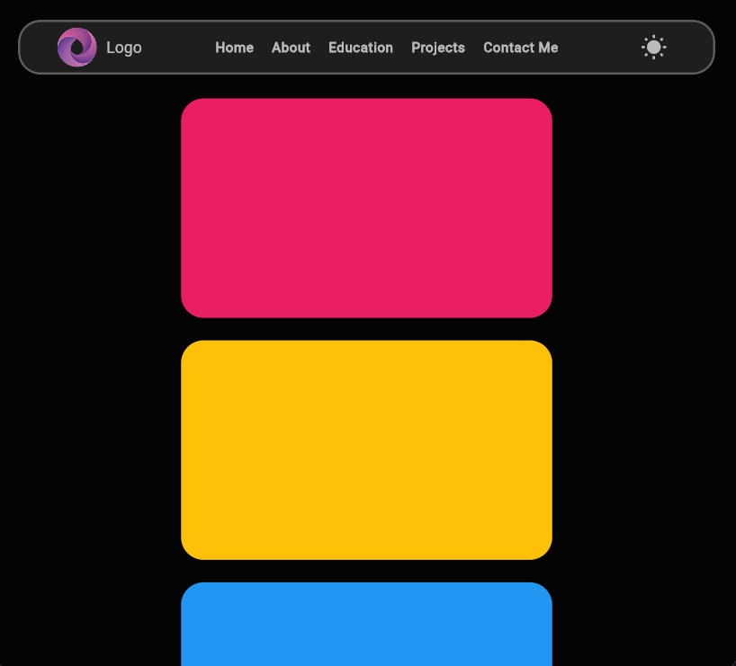
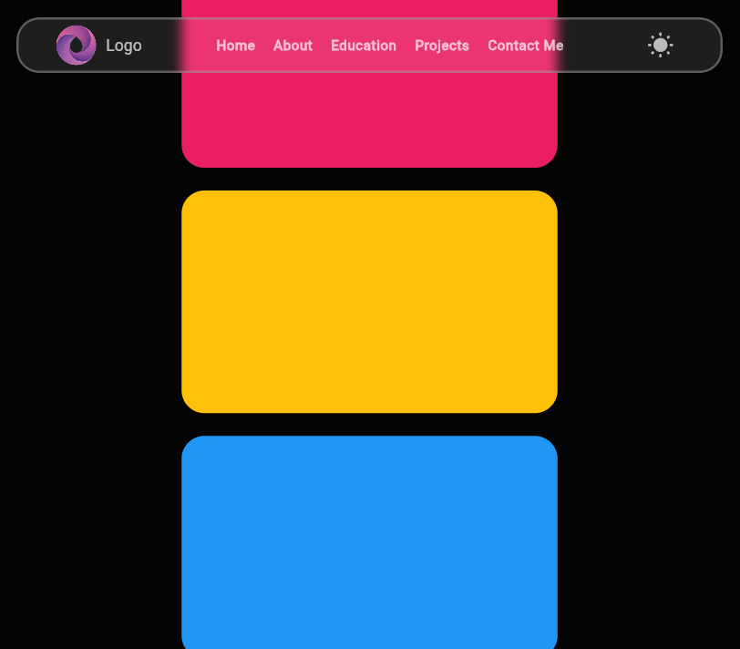
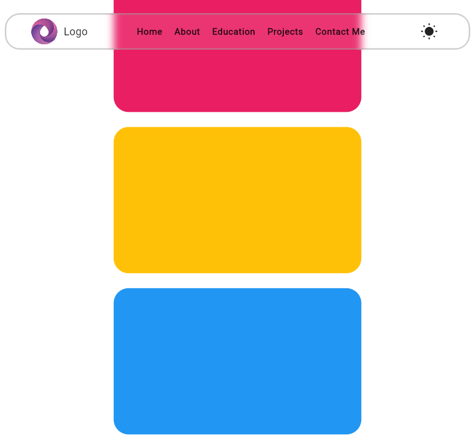
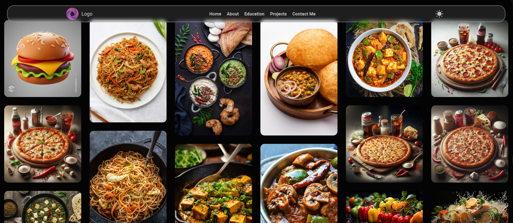
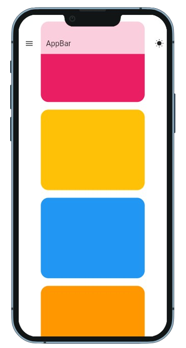
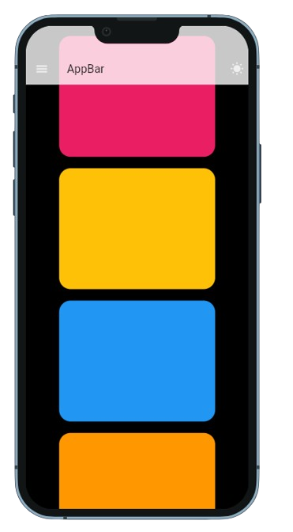
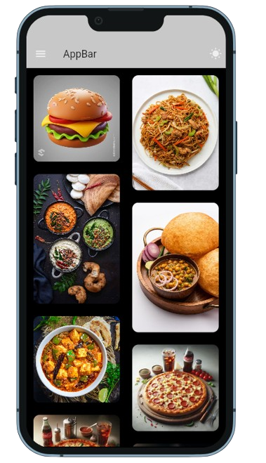

# Floating transparent ApBar

This is a floating AppBar/NavBar made with flutter, with a blur effect.

The app-baar and the background can be customized accordingly to the UI design as needed, you can make a custom screen/widget and replace the existing one easily.

## How to run the app


add required dependancies to pubspec.yaml

```
flutter pub get
```

in the root directory, run the code

```
flutter run
```


to use the device preview, replace the main() code with the below code
```
void main()  async {
  await dotenv.load(fileName : "assets/.env");
  runApp(
  DevicePreview(
    // enabled: !kReleaseMode,
    builder: (context) => MyApp(), // Wrap your app
  ),
);}
```


# Screenshot of flutter app

<div>
    
    
    
    <br>
    
    
</div>
<div style="display: flex; justify-content: flex-start; margin: 6px;">
    
    
    
</div>


# TODO


- [X] Make a floating app-bar with blur effect

- [ ] Make it responsive 

- [ ] Make a masonry/staggered view 


 
Flutter :blue_heart: