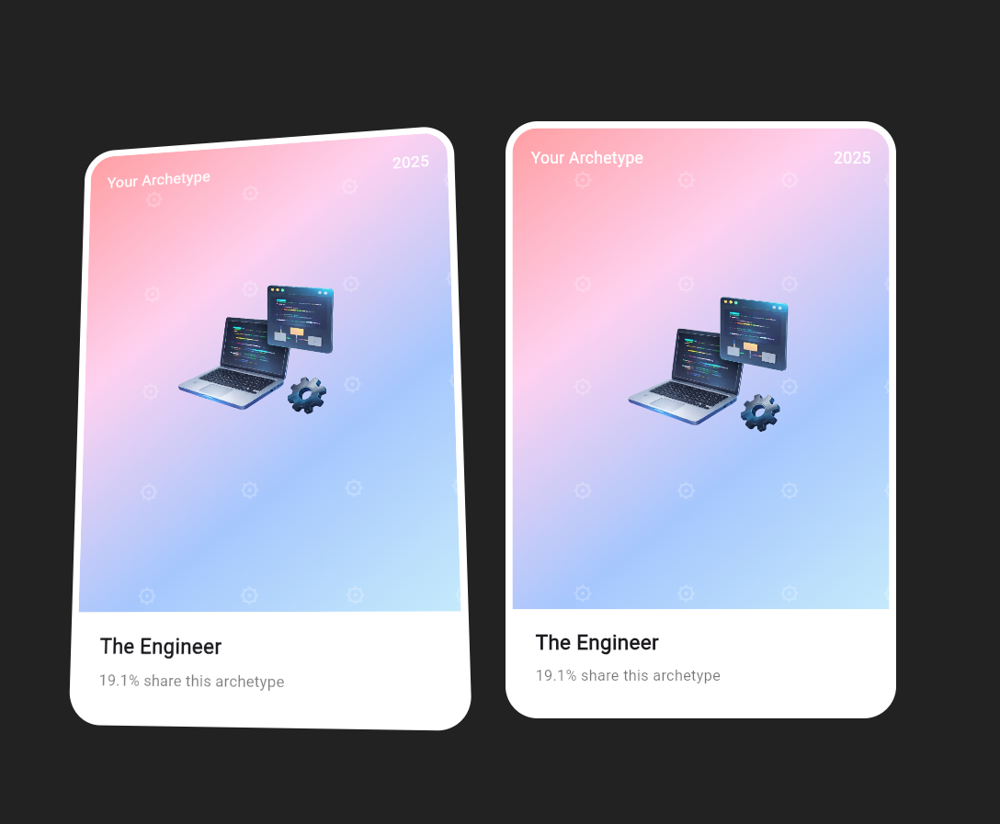

# 3D Holographic Tilt Card (Flutter)

A Flutter widget that creates a **3D tilt card with parallax, motion tilt (accelerometer), holographic shader, and floating logo pattern**. Works on **Web, Android, iOS, and Desktop**.

<p align="center">
  
</p>

---

## ✨ Features

- 3D card tilt on **mouse hover** (web/desktop)
- Real-time **device tilt** using accelerometer (mobile)
- Parallax motion for central hero image
- Optional holographic **fragment shader effect**
- Animated floating logo background
- Customizable title, subtitle, year, and image
- Smooth subtle animations

---

## 📦 Dependencies (pub.dev)

Add to your `pubspec.yaml`:

```yaml
  sensors_plus: ^7.0.0
```

### How to run
```
flutter pub get
flutter run
```

### Adjusting Parallax/Tilt
To adjust the tilt/transform sensitivity
```
tiltY = dx * 0.2;
tiltX = -dy * 0.2;
```
change these values in <b>lib\card.dart</b>

to adjust Parallax intensity
```
parallaxX = dx * 20;
parallaxY = dy * 20;
```
adjust these values

## ⚠️Notes-
- Transparent PNG images recommended for better parallax effect
